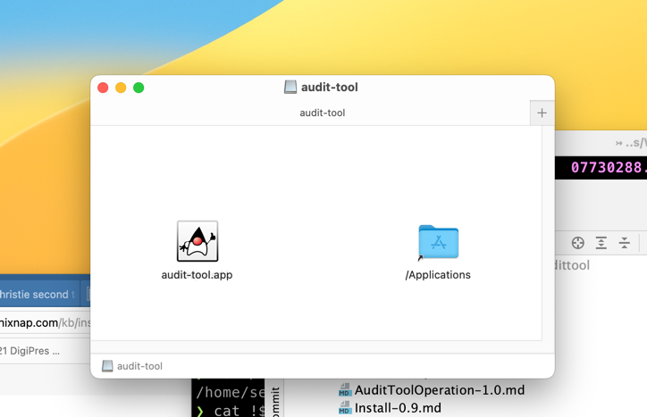

# Build and Release
## Prerequisites
### Tools
The java build platform **maven** is required. 
- MacOS:`brew install mvn`
- Debian `sudo apt install maven`
- Windows - No installation process, a sample installation is shown at (phoenixNAP)[https://phoenixnap.com/kb/install-maven-windows]
  You will also need these - install in order:
  - Windows Java:  See [Oracle JDK 17 downloads](https://www.oracle.com/java/technologies/downloads/#jdk17-windows)
  - Windows .NET `winget install Microsoft.DotNet.SDK.6`
  - Windows WIX toolkit `dotnet tool install --global wix`. Then close your terminal window and open another one, to
use the `wix` that is on the changed path.
  - 
## Build
All versions of Audit tool can be built using maven. The relevant hierarchy is 

```
├── audittool
│   ├── pom.xml
│   ├── IAudit
│   │   ├── pom.xml
│   ├── audit-test-shell
│   │   ├── pom.xml
│   └── test-lib
│   │   ├── pom.xml
```

Each submodule references its parent by this node:
```xml
    <parent>
        <artifactId>audit-tool</artifactId>
        <groupId>io.bdrc.audit</groupId>
        <version>1.0-beta-1</version>
    </parent>
```

Note that the parent version must be hard coded.

In either the parent or the submodules, you can work with the complete Maven phases. Typically, 
developers would build using the

`mvn clean install` 

command in the auditool directory.

### Building for debugging
In the IntelliJ environment, you configure the debugger to `mvn compile` before launching.
This is shown in the resulting config file: `audittool/.run/shell.run.xml`
(See Intellij Menu --> Run --> Edit Build Configurations --> Application --> Shell) for the UI selections that built
the `shell.run.xml` file.)

The compile phase also copies resources file from `src/scripts` into the output folder for testing and packaging.

## Packaging
The work of pulling together an audit-tool distributable is done in the `audit-test-shell` module's `pom.xml`, in 
the `package` phase. It uses the `maven-assembly-plugin` whose configuration given in
`audit-test-shell/src/main/assembly/shell-assembly.xml`
Essentially creates a zip file and a directory that can be copied and manually installed
anywhere.

This will unpack an upgrade to v0.9, but it will still need v0.9's special shell script and environment
scaffolding (see Install-0.9.md) 

## Building an installation kit
Building an installation kit is as simple as using 

```shell
cd ${audittool local_git_repo_home}
mvn clean install
mvn package # optional, if this is the first time you're building on the target platform
cd ${audittool local_git_repo_home}/audit-test-shell
jpackage @src/main/script/jpackage_${platform}.conf
```

where `${platform}` is one of `{debian|win|MacOS}` and matches the system you are running on.
(`jpackage` only builds executables for the platforms it runs on)

**MacOS note: Installing your newly build config**
The process of building an exportable app on MAC is extremely tedious, and only performed on releases where we 
know the intended audience cannot build it.  Happily, Macs **will** run application installers that were created 
on their own machine. So to build your own update on MAC, have Java (17 recommended) and maven installed, run `mvn package`
as shown above, and then run the above building steps. The jpackage command takes about 15 - 20 sec to run. When it completes,
you should see 

**Important** be sure to save away any config customizations
