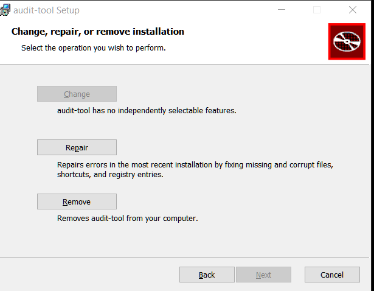
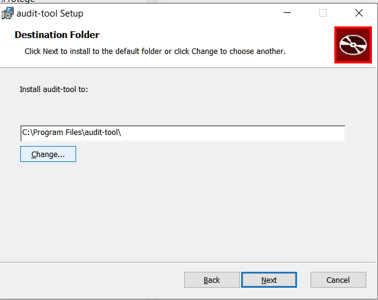
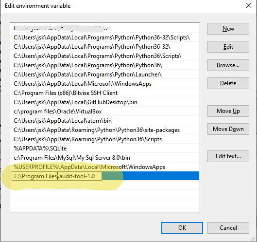

#  Audit Tool Installation

## Version Information
Use these values of VER and REL where they appear below
- Current VER is 1.0
- Current REL is alpha

## Supported Platforms

- Windows 10
- Mac OS X 11.6 (Big Sur) or earlier
- Debian 10 (Buster)

**Note**: Release 1.0-alpha does not require supplementary installs such as:
- Powershell 3.0 on windows
- gnu coreutils on MacOS

## Download
Releases are available on [asset-manager-code Releases](https://github.com/buda-base/asset-manager/releases)

Download:

### Windows download
### Debian download
### MacOS download

## Install

### Install procedures
### Windows installations

#### Run the launcher `audit-tool-1.0.exe`


If audit tool was installed when you launched, you have an opportunity to choose your action:


You can choose your installation directory:


**Note** if you choose the default installation directory, `audit-tool` will be available to all users of the computer on which it is installed.


#### Setting path
audit-tool still needs to be launched from a console window (such as [Windows Terminal](https://www.microsoft.com/en-US/p/windows-terminal/9n0dx20hk701?activetab=pivot:overviewtab) or  [Fluent Terminal](https://www.microsoft.com/en-us/p/fluent-terminal/9p2krlmfxf9t?activetab=pivot:overviewtab) ).
You may find it helpful to add its location to your PATH.

Settings (You can reach this with the shortcut WindowsKey+Pause) --> find

Edit Environment variables


Select 'Path' and click 'Edit' as shown here:

You'll see each line. Add the line of the installation directory.


You will see a table of your environment variables.

Add the last line (the default installation is shown as an example)




## Configuration
### Sample Run

Configuration is performed by running `$AT_INSTALL_HOME/audit-tool-config.sh`


A sample run is shown below:

 ```bash
❯ audit-tool-config.sh
This script prompts you for a file path and saves the answers in '.../.config/bdrc/auditTool/config'.

It asks for the jar file which runs the whole process.
You press [Enter] to accept the defaults.
Press [Enter] when you are ready to continue.
Enter the path to the jar file which launches the process [ default ".../xxx/audit-test-shell-0.9-SNAPSHOT-1.jar" ]?
```

### Walkthrough
- audit-tool-config.sh sets  environment variables which the running script, `audittool.sh` refers to:
  - CONFIG_SHELL_JAR_FILE: the file name of the .JAR which launches the tests and logs their results.
  - CONFIG_ATHOME: The folder in which Audit Tool is installed. This is useful, because it allows you to move `audittool.sh` into your path, and it will still run the jar file in the configured path.

Since audit-tool-config.sh stores preferences in a **per-user** folder, you might want to create a template which saves these variables.
You do this by editing `$AT_INSTALL_HOME/DEFAULT-BDRC-AT-CONFIG.sh` When you know the location of the  downloaded files.

#### Installation troubleshooting

The configuration will fail:
- if you have no existing per-user config file,
- and no default config file,
- and you do not type values in at the prompts.

It also warns if the files you enter don't exist, but writes the values anyway, expecting you'll get around to it later.

## Guidelines for Updating an existing installation
Installation overwrites any prior installations.
It is advisable to unzip an update into a scratch directory and merge any site customizations into it before making it available on a server.
