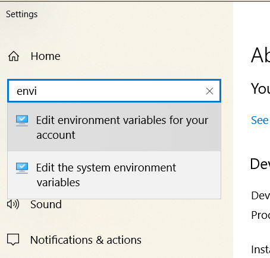
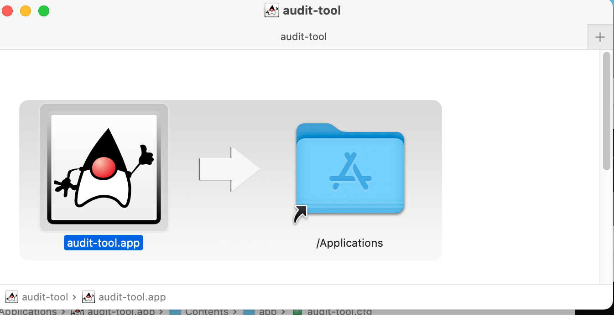

#  Audit Tool Installation

## New In Version 1.0
Version 1.0 is built and packaged under the most current LTS (Long Term Support) version of Java, 17. It exploits a packaging utility which provides native installation packages on supported MacOS, Debian, and Windows 10 platforms. This provides:

- No requirement for pre-installed Java - Audit-tool provides its own JRE (Java Runtime Engine), at JRE 17.3
- No need to configure a new install.
- Much simpler configuration: shell and Powershell scripts are no longer required.
-
## Version Information
Use these values of VER and REL where they appear below
- Current VER is 1.0
- Current REL is alpha

## Supported Platforms

- Windows 10
- Mac OS X 11.6 (Big Sur) or earlier 11. MacOS 10 version have not been tested.
- Debian 10 (Buster)

**Note**: Release 1.0-alpha does not require supporting packages such as:
- Powershell 3.0 on windows
- gnu coreutils on MacOS
- Java

## Download
Releases are available to download on [asset-manager-code Releases](https://github.com/buda-base/asset-manager/releases)

Download:

### Windows download
### Debian download
### MacOS download

## Install

### Install procedures
### Windows installations

#### Run the launcher `audit-tool-1.0.exe`

If audit tool was installed when you launched, you have an opportunity to choose your action:

You can choose your installation directory:

**Note** if you choose the default installation directory, `audit-tool` will be available to all users of the computer on which it is installed.

#### Setting path
audit-tool still needs to be launched from a console window (such as [Windows Terminal](https://www.microsoft.com/en-US/p/windows-terminal/9n0dx20hk701?activetab=pivot:overviewtab) or  [Fluent Terminal](https://www.microsoft.com/en-us/p/fluent-terminal/9p2krlmfxf9t?activetab=pivot:overviewtab) ).
You may find it helpful to add its location to your PATH.

Settings (You can reach this with the shortcut WindowsKey+Pause) --> find

Edit Environment variables

Select 'Path' and click 'Edit' as shown here:

You'll see each line. Add the line of the installation directory.

You will see a table of your environment variables.

Add the last line (the default installation is shown as an example)

### MacOS installation
Open the downloaded package:

and drag 'audit-tool.app' to '/Applications'

### Debian installation

## Configuration
This section applies to all platforms.

`audit-tool` now uses the `app/` subfolder of its installation directory for all its configuration. This file is generated by the install process. Changes you make to it will be overwritten when the application is re-installed.

This configuration replaces the `AT_HOME` and `CONFIG_ATHOME` settings of prior releases. Users with write permission can simply edit the `app/` files:

File|Purpose
---|---
audit-tool.cfg  | Generated list of complete properties to launch the application. Changes to this list are unsupported  
shell.properties  | Parameters for tests (such as names of directories, limits and error overrides)
log4j2.properties  | Logging control

Detailed configuration is described in [AuditToolOperation-1.0-alpha.md](./AuditToolOperation-1.0-alpha.md)

## Guidelines for Updating an existing installation
Installation overwrites any prior installations.
It is advisable to save existing configurations in the `app/` folder of the install and **carefully* merge them into a new install.
