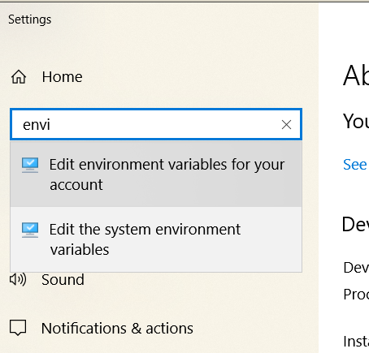
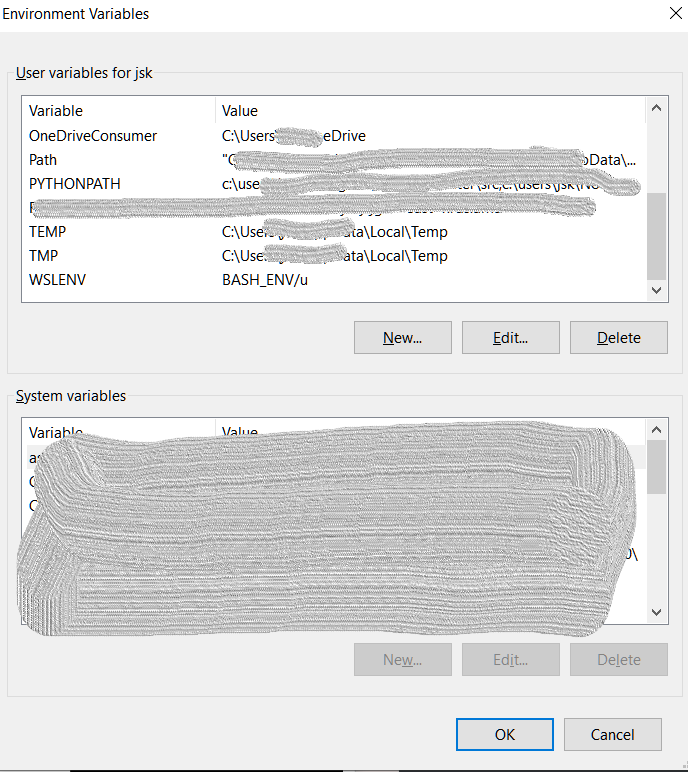
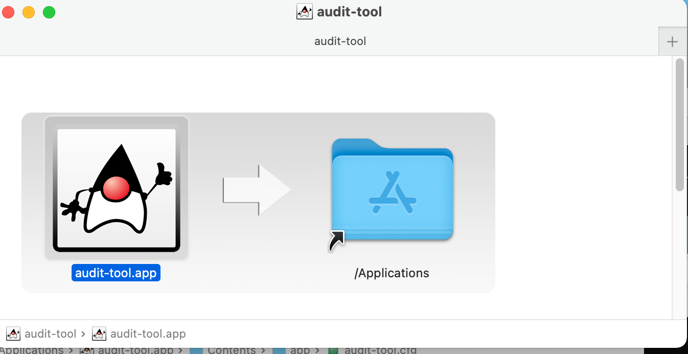

#  Audit Tool Installation

## New In Version 1.0
Version 1.0 is built and packaged under the most current LTS (Long Term Support) version of Java, 17. It exploits a packaging utility which provides native installation packages on supported MacOS, Debian, and Windows 10 platforms. This provides:

- No requirement for pre-installed Java - Audit-tool provides its own JRE (Java Runtime Engine), at JRE 17.3
- No need to configure a new install.
- Much simpler configuration: shell and Powershell scripts are no longer required. See [Configuration](#Configuration) for
details on upgrading.
- 
## Version Information
Use these values of VER and REL where they appear below
- Current VER is 1.0
- Current REL is beta

## Supported Platforms

- Windows 10
- Mac OS X 11.6 (Big Sur) or earlier 11. MacOS 10 version have not been tested.
- Debian 10 (Buster)

**Note**: Release 1.0-alpha does not require supporting packages such as:
- Powershell 3.0 on windows
- gnu coreutils on MacOS
- Java

## Download
Releases are available to download on [asset-manager-code Releases](https://github.com/buda-base/asset-manager/releases)

Download:

### Windows download
### Debian download
### MacOS download

## Install

### Install procedures
### Windows installations

#### Run the launcher `audit-tool-1.0.exe`


If audit tool was installed when you launched, you have an opportunity to choose your action:


You can choose your installation directory:


**Note** if you choose the default installation directory, `audit-tool` will be available to all users of the computer on which it is installed.


#### Setting path
audit-tool still needs to be launched from a console window (such as [Windows Terminal](https://www.microsoft.com/en-US/p/windows-terminal/9n0dx20hk701?activetab=pivot:overviewtab) or  [Fluent Terminal](https://www.microsoft.com/en-us/p/fluent-terminal/9p2krlmfxf9t?activetab=pivot:overviewtab) ).
You may find it helpful to add its location to your PATH.

Settings (You can reach this with the shortcut WindowsKey+Pause) --> find


Edit Environment variables



Select 'Path' and click 'Edit' as shown here:


You'll see each line. Add the line of the installation directory.


You will see a table of your environment variables.

Add the last line (the default installation is shown as an example)


### MacOS installation
Open the downloaded package:



and drag 'audit-tool.app' to '/Applications'

### Debian installation

Values in this table are referred to in the instruction as `{Property}`. (eg, `{Package name}`)

| Property            | Value                            |
|---------------------|----------------------------------|
| Application name    | `audit-tool`                     |
| Application version | `1.0-alpha`                      |
| Package name        | `audit-v1`                       |
| Package-Release     | 1                                |
| Package File name   | `audit-v1_1.0-alpha-1_amd64.deb` |
| Install location    | `/opt/audit-v1`                  |
| Executable          | `/opt/audit-v1/bin/audit-tool`   |

Download: TODO: web loc `audit-v1_1.0-alpha-1_amd64.deb` into `some_folder`
Install: `sudo apt install -f some_folder/audit-v1_1.0-alpha-1_amd64.deb`
This creates a package in the Install location above, overwriting existing contents and configurations.


There are several options for general user access:
1. Add `/opt/{Package Name}/bin` to the path of any users who use it.
2. Create a symbolic link in a generally public path: `ln -s /opt/{Package name}/bin/audit-tool`
3. Use the `update-alternatives` scheme to install the version into a list of choices (to allow multiple global installations). While this is more cumbersome, it is more sysadmin friendly than writing directly into /usr/local/bin.

It also automatically creates a link into any directory you choose (in this example, we use `/usr/local/bin`, but you're free to create your own distribution means.)

Suppose you want to install a new version and retain the older one. Since BDRC always changes the package name on every release, you would install them separately.
For this example, we've installed two versions:
audit-tool-v1 and audit-tool-v1.1

To configure for easy change over, we would:

```
$ sudo update-alternatives --install /usr/local/bin/audit-tool audit-tool /opt/audit-v1/bin/audit-tool 50
$ sudo update-alternatives --install /usr/local/bin/audit-tool audit-tool /opt/audit-v1.1/bin/audit-tool 55
```
You can see the results here, by invoking the config switcher:

```
$  sudo update-alternatives --config audit-tool

There are 2 choices for the alternative audit-tool (providing /usr/local/bin/audit-tool).

  Selection    Path                            Priority   Status
------------------------------------------------------------
* 0            /opt/audit-v1.1/bin/audit-tool   55        auto mode
  1            /opt/audit-v1.1/bin/audit-tool   55        manual mode
  2            /opt/audit-v1/bin/audit-tool     50        manual mode

Press <enter> to keep the current choice[*], or type selection number:
```
You would simply press 1 or 2 here to change the versions you want users to run.


## Configuration
This section applies to all platforms.

`audit-tool` now uses the `app/` subfolder of its installation directory for all its configuration. This file is generated by the install process. Changes you make to it will be overwritten when the application is re-installed.

This configuration replaces the `AT_HOME` and `CONFIG_ATHOME` settings of prior releases. Users with write permission can simply edit the `app/` files:

| File              | Purpose                                                                                               |
|-------------------|-------------------------------------------------------------------------------------------------------|
| audit-tool.cfg    | Generated list of complete properties to launch the application. Changes to this list are unsupported |
| shell.properties  | Parameters for tests (such as names of directories, limits and error overrides)                       |
| log4j2.properties | Logging control                                                                                       |

Detailed configuration is described in [AuditToolOperation-1.0.md](AuditToolOperation-1.0.md)

## Guidelines for Upgrading from v0.9
### Command line properties
Review any customizations you have made to the audit tool script (`audittool.sh` on Mac and Debian/ `audittool.ps1` on Windows) and move them into
the installation directory's `app/audit-tool.config`, in the `[JavaOptions]` section.

### shell properties
If you've made sitewide changes to properties in 0.9, be sure to merge them into the installation's `app/shell.properties` file.
**Do not overwrite `shell.properties`. It may have new properties that v0.9 does not**

### user properties
Individual user properties (in the `user.properties` file) do not require update. The other user configuration scripts are no longer used.
## Guidelines for Updating an existing installation
Installation overwrites any prior installations.
It is advisable to save existing configurations in the `app/` folder of the install and **carefully* merge them into a new install.
