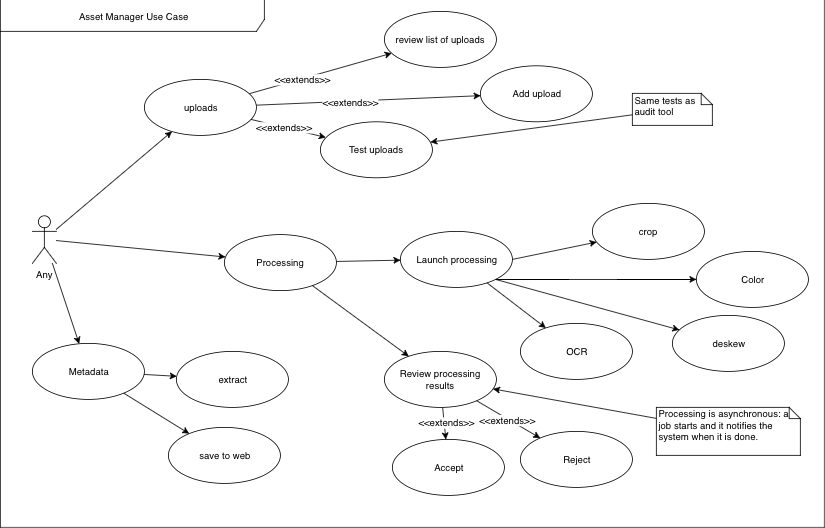

# Asset Manager Project Documentation
## References
1. Ngawang Trinley [Buddhist Digital Resource Center Digitization Guidelines](https://buddhistdigitalresourcecenter.github.io)

## Functionality
The Asset manager contains two subsystems:
1. The **Audit Tool**, which BDRC will deploy to the field, for DPEs. The audit tool is a standalone application which can run on Windows 7 - 10, or Mac OS 10.12 (?) or newer. The Audit tool allows BDRC to accept or reject scanning work while the scanning staff is still present. It also allows assembling a package which the field can upload for further processing.
2. The **Asset Manager** is a web application which allows BDRC to process the uploaded packages, creating content streams which:
    + BDRC archives for preservation,
    + the BDRC web application can view
    + updates BDRC metadata.

### Audit Tool
The Audit Tool use case is shown here:

### Asset Manager
The Asset Manager use case is shown below:

## Design
### Goals
#### Shareable Objects
Use the same code for data entities and other processing which are common to both level processes:
+ Submission packages
+ Metadata
+ Test initiators
+ Test Results
+ Logs

#### Validation Dynamic Discovery
Some operations involve a set of tests against an object. Tests will be discoverable, and will be written in terms of an interface: a template which developers can use to extend the set of tests. The goal is to allow a developer to create or modify tests without a full release of the framework. These tests are best grouped by the object of the test, such as a delivery packet, a folder, or a work folder structure (e.g. files and folders)
