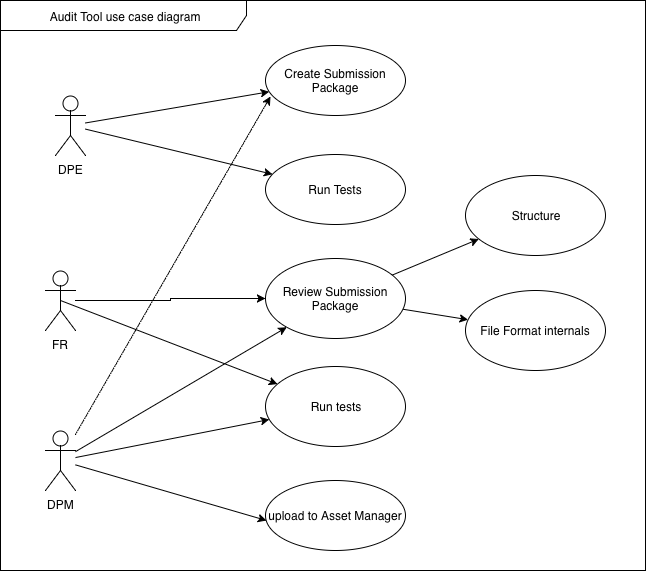

# Asset Manager Project Requirements
## References
1. Ngawang Trinley [Buddhist Digital Resource Center Digitization Guidelines](https://buda-base.github.io/digitization-guidelines/)
2. Design Documents:

## Functionality
The Asset manager contains two subsystems:

1. The **Audit Tool**, which BDRC will deploy to the field, for DPEs. The audit tool is a standalone application which can run on Windows 7 - 10, or Mac OS 10.12 (?) or newer. The Audit tool allows BDRC to accept or reject scanning work while the scanning staff is still present. It also allows assembling a package which the field can upload for further processing.

2. The **Asset Manager** is a web application which allows BDRC to process the uploaded packages, creating content streams which:
    + BDRC archives for preservation,
    + the BDRC web application can view
    + updates BDRC metadata.

### Audit Tool
The Audit Tool use case is shown here:

The audit tool supports multiple users who can submit, review, and approve or reject submissions.
It also supports transferring to asset manager a package which contains both the content and the required metadata.
It has limited reporting capability, as it is meant to be decentralized, and work only on standalone computers, operating on a local disk.

In the diagram above, "Run Tests" means to run a specified set of tests to evaluate the submission's integrity. These tests include
### Asset Manager
The Asset Manager use case is shown below:

The Asset Manager provides a richer set of operations.
#### Review
Users access a dashboard which shows the processing status of collections which are awaiting processing.
#### Test submission
Perform the same tests as the [Audit Tool](#Audit Tool) does.
#### Process Control
Users control the image processing: launch and monitor processing workflows.
#### Image processing
Use external resources (either open source libraries, or possibly third party network APIs) to process images. Processing steps include:

- Determining values for the following parameters, and saving those into a recipe:
  - optimal cropping box for the contents.
  - a deskewing transform, to remove any effects of image or camera tilt.
  - some limited color correction
#### Derived image creation
Create derivative file formats form the archival masters.
#### OCR
Transmit images to a web service which will return text and other metadata. Further processing for this metadata is TBD.
#### Web deployment
Deploy some of the derivative works and selected metadata to the BDRC display platforms.
