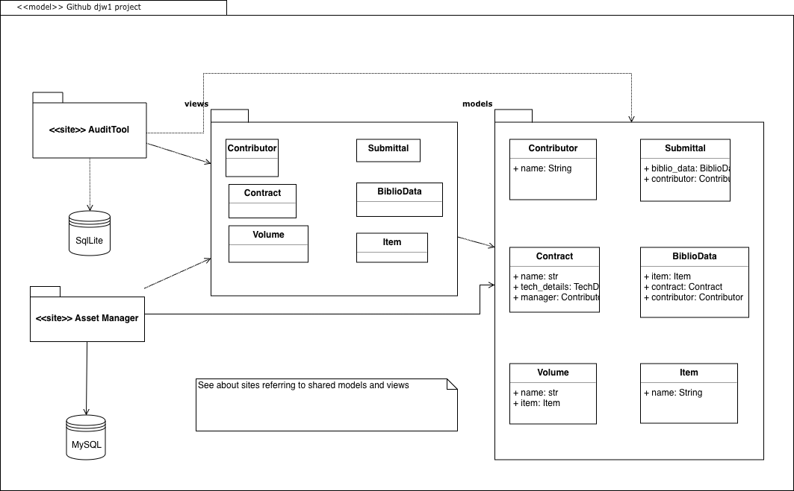

# Asset Manager Design
## Goals
### Shareable Objects
Use the same code for data entities and other processing which are common to both level processes:
+ Submission packages
+ Metadata
+ Test initiators
+ Test Results
+ Logs

### Validation Dynamic Discovery
Some operations involve a set of tests against an object. Tests will be discoverable, and will be written in terms of an interface: a template which developers can use to extend the set of tests. The goal is to allow a developer to create or modify tests without a full release of the framework. These tests are best grouped by the object of the test, such as a delivery packet, a folder, or a work folder structure (e.g. files and folders)

## Architecture
### Research
One way to have a deliverable which presents the same UI would be to deliver a local website to the Audit Data users and have a central website (or sites) for Asset Manager.
#### Test site
First pass tries to share models and views in a site:

