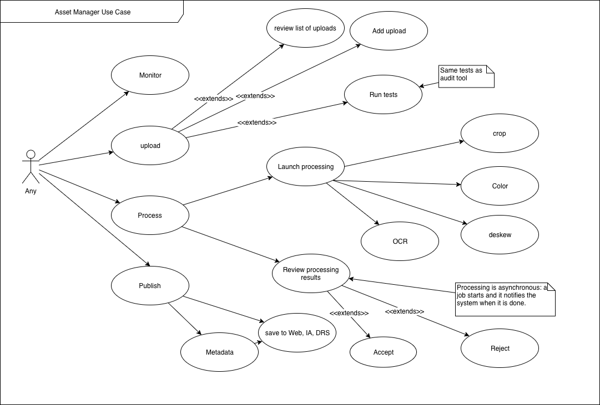
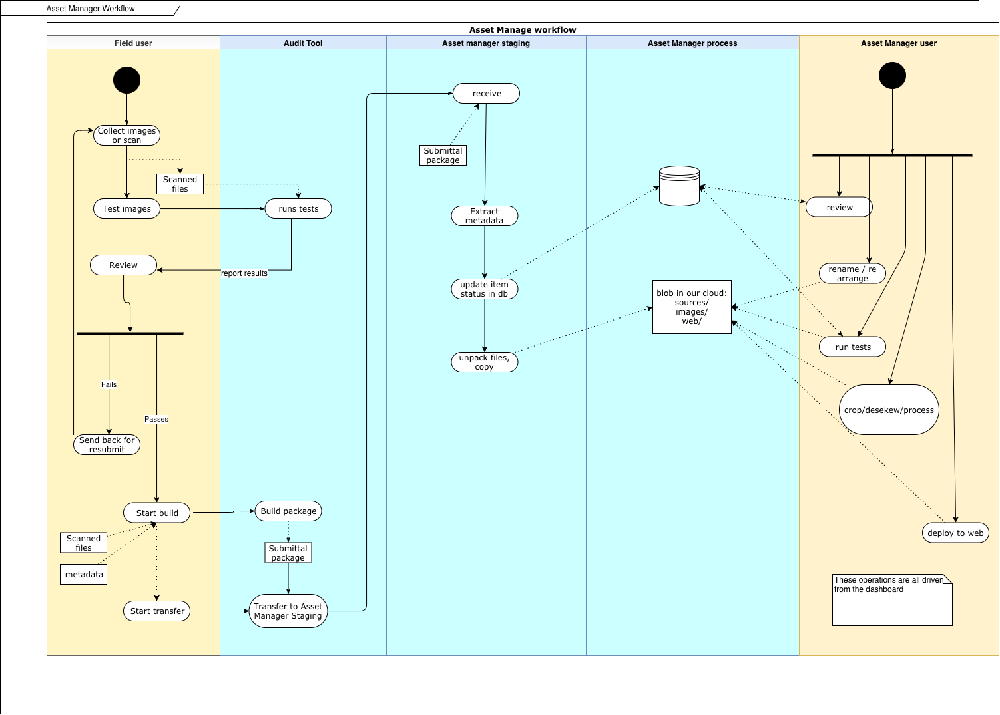
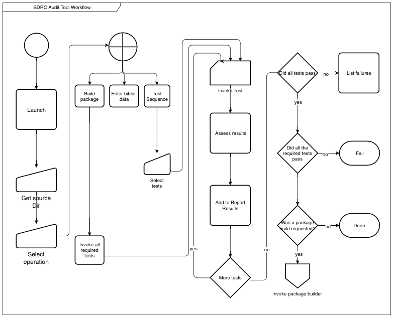

# Asset Manager Requirements
## Overview
The Asset Manager project intends to meet two important BDRC needs:

1. Reduce the backlog of images which we have scanned and catalogued, but are not yet available to the web users.
2. Enhance the integrity of new scans by allowing iterations of scanning, review, changes, and re-scanning in the field.

## Referenced documents
- [1] [Digitization standards Folder Structure](https://buda-base.github.io/digitization-guidelines/#standards/standards-en/)
- [2] [bdrc-audit prototype to do list](https://github.com/ngawangtrinley/bdrc-audit/blob/master/README.md)

## Definitions

**Work** A Work is the denomination of submitted content. The work's name is its "key" field, and is its well-known name.
**Submittal** A submittal, or submission, is the content of the "work," along with metadata which directs its entry into the Asset Manager (for example, the work name)

As in any good software practice, the public name of a work or submittal is editable, while its internal identifier remains unchanged.

## Scope of Asset Manager
### Acquisition channels
The Asset Manager will process new scanned packages, but will also maintain an inventory of our backlog of unpublished assets. It will support the three channels of acquisition:

1. The previously submitted backlog of catalogued holdings, which need processing before they are suitable for deployment.
2. The output of ongoing BDRC managed projects, such as USAID, EAP, FPL, and ACIP Mongolia
3. Unsolicited input in a variety of formats.

### Partial Progress
A complete content package contains three copies of the content, in containers named:

* sources
* archive
* web

**Sources** is the unprocessed output of the scanning device or camera, or of software.

**Archive** is  ???

**Web** is the processed images which are suitable for download.

BDRC contributors do not always present all the copies of the content at the same time. Often, the web deliverable is the first to arrive.
Asset Manager presents a packaging interface which supports partial submittals and tracking of submittal progress.
## Asset Manager user profiles
The Asset Manager suite supports different profiles of users. There is no current requirement to restrict functionality by user. If a user has access to the application, they can perform any function on it. The Asset Manager never deletes a resource, it only changes the state information of the resource's metadata. All those changes are reversible.
User communities are:

* BDRC library users: These are our end consumers of [tbrc.org](http://tbrc.org).Their capacity to use the TBRC website is determined by their computers' image processing and network power. One end of capability, is  graphics workstations  attached to the Internet backbone. At the other end, they are Nepali or Tibetan monks referring to an image on a cell phone served by a 2 or 3G cellular service.
* Field scanning staff: This group contains all the BDRC employees and contractors who perform the first level of scanning, review, and intake of digital media. Reference [1](https://buda-base.github.io/digitization-guidelines/#workflow/workflow-en/#digitization-workflow) contains details of these user profiles.
* Curation staff: These are the BDRC archivists and librarians who manage the processing and deployment of BDRC holdings.
## Functional Requirements
This document groups the Asset Manager requirements into three buckets:

1. **Audit Tool**: The requirements for a component which allows BDRC field managers to review a submission and approve or reject it.
2. **Asset Manager**: A platform which allows a user to:

    - Review status of scans: not started, underway, complete
    - Validate that packages meet standards. The **Audit Tool** functionality will be in the Asset Manager: Audit Tool is a repackaging designed for installation in remote systems.
    - Invoke image processing tools to prepare images for web deployment.
  - Deploy works to the BDRC web.

3. **Shared Requirements**

    - Testing: Provide tests in a code format which both tools can use
    - Reporting: show the passing or failing of tests, and the processing results of processing steps
    - Package building: A component which creates a package which **Audit Tool** and **Asset Manager** can consume.

## Audit Tool
The Audit Tool use case is shown here:

The audit tool supports multiple users who can submit, review, and approve or reject submissions.
It also supports transferring to asset manager a package which contains both the content and the required metadata.
It has limited reporting capability, as it is meant to be decentralized, and work only on standalone computers, operating on a local disk.

In the diagram above, "Run Tests" means to run a specified set of tests to evaluate the submission's integrity.

## Asset Manager
The Asset Manager use case is shown below:

The Asset Manager includes the auditing tools and also provides management facilities for tracking submission progress, image processing and web deployment.

All the specific areas below will present interfaces for changing a submittal's state.

## Workflow

High level flowchart of Asset Manager and Audit tool

## Asset Manager functionality
This section lists the functions of the asset manager.
### Review
Users access a dashboard which shows the processing status of collections which are awaiting processing.
### Test submission
Perform the same tests as the [Audit Tool](#Audit Tool) does.
### Process Control
Users control the image processing: launch and monitor processing workflows.
### Image processing
Use external resources (either open source libraries, or possibly third party network APIs) to process images. Processing steps include:

- Determining values for the following parameters, and saving those into a recipe:
  - optimal cropping box for the contents.
  - a de-skewing transform, to remove any effects of image or camera tilt.
  - some limited color correction
- Storing and linking output

### Derived image creation
Create derivative file formats form the archival masters.
### OCR
Transmit images to a web service which will return text and other metadata. Further processing for this metadata is TBD.
### Web deployment
Deploy some of the derivative works and selected metadata to the BDRC display platforms. Asset manager will allow updating of sections of works at any level of granularity from the work down to the individual image.

## Shared Requirements
These requirements are drawn from
- [Asset Manager v.01 Core Requirements](https://docs.google.com/document/d/1oVjpQ8PWjXNLgDDaUI5H-O07iaf0RjR3Ff79AwnMluo)
- [Asset Manager v-1.0](https://drive.google.com/open?id=1QvMgnUNnCYawPOplDbWkkzuWrpw0avWL3OWzf5Qxd24)
- And the to-do section of [BDRC Audit Prototype README](https://github.com/ngawangtrinley/bdrc-audit/blob/master/README.md)

See [Test Requirements](tests.md) for detailed requirements.

- Number of files per folder
- File Type Requirement
- Canonical paths
- Audit biblio-sheet
- Validate upload package

# Detailed Requirements
## Audit Tool
### Host Platform
The Audit Tool has to be deployable by BDRC onto any MacOS or Windows 7+ PC within a reasonable length of time. The BDRC people should know how to configure the Audit Tool.

### Invocation

### Configuration
The user should be able to set some test parameters (for example, resolution) differently for each test instance.

#### Launch
The Audit Tool should be callable from the command line of either platform.
The command line invocation should either start a text-mode or a windowed dialog. The dialog prompts the user for the directory containing the scans.
#### Operation
Either of these prompts can be given as arguments
1. Prompt the user for the location of the **single work** to operate on.
2. Select the operation:
   - Perform Tests
   - Fill in biblio-data
   - Build package

##### perform tests
1. the user selects test from a list. Some tests are required, some are optional. The platform will show which is which.
2. The system runs each test in turn, and records the results.
3. The system displays the results.

[Test Requirements](tests.md) documents each test's parameters and success criteria.

##### Enter biblio-data
The system prompts the user for the bibliographical data. It saves the data in a format which the package builder will include. The biblio-data might be what the scanning operator or their project manager input into the spreadsheet (see [Bibliographic Data Sheet](https://buda-base.github.io/digitization-guidelines/#standards/standards-en/))

**Implementation note:** The python `xlrd` package supports extracting data from an Excel sheet. If we truly require input sheets to be `.xlsx` format, we could consider expanding the biblio-sheet to include the data which auditing requires. That would validate the biblio sheet first. )

The biblio sheet must include at a minimum:

- Work Name
- Volumes Names
- Scan Date
- BDRC Contract identifier
- Scanning Requirements specific to the contract
- Info on person who scanned the document (BDRC ref number, or email, or name, or some combination)
- **Any other information the Asset Manager requires** This will be an ongoing requirement. The Audit tool validation mechanism may be changed with every release. If needed, it will provide the Excel template for the biblio-data.

##### Build upload package
1. The user invokes the build package through the user interface.
2. The system:

- runs all the **required** tests. If they pass, it
- builds the upload package only if this invocation of the tests passes.

The upload package contains:
  - production information:
    - Scanning organization
    - BDRC Personnel sign-off:
      - DPE
      - FR
      - DPM
  - submitter id: a valid email address for the submitter.
  - work information: (see biblio-data above)

The sign-offs are only required for the Asset Manager to intake the submittal package. A DPE or FR can sign their portions, but the DPM has to add their signature to the package before the Asset Manager will accept it.

##### Package Uploader
Upload the package. If the package passes the `Validate upload package` test, this facility transfers it to a resource where further processing can occur. [^12b45fa9]

[^12b45fa9]: This should be a separate, controlled facility. We don't want DPEs or FRs to upload.
