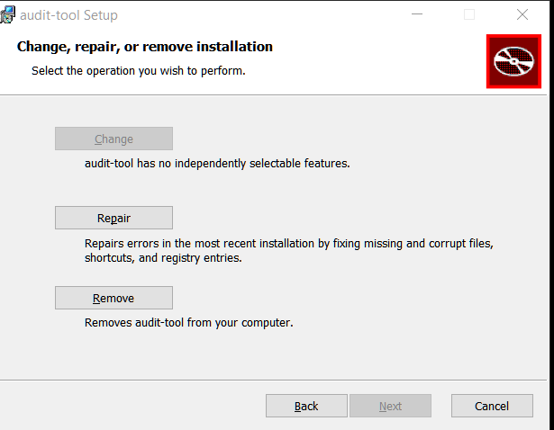
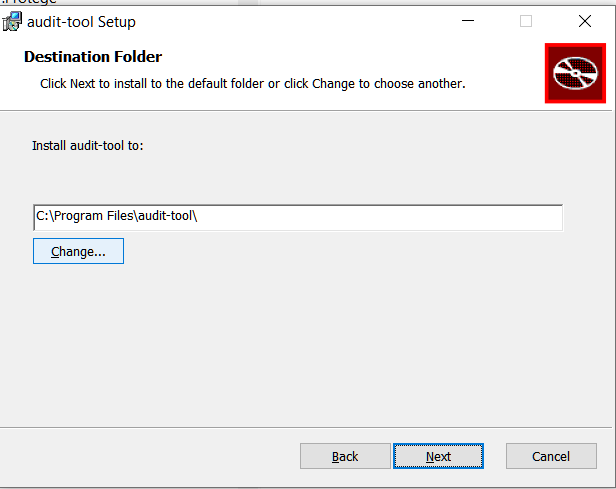
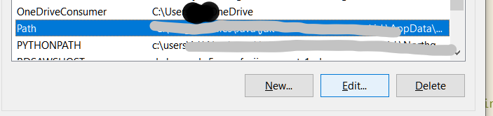
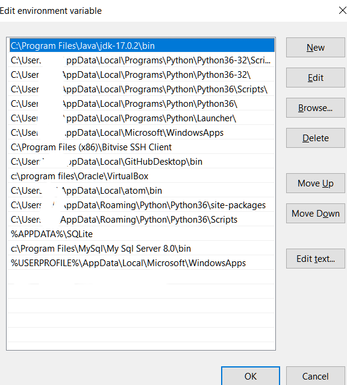
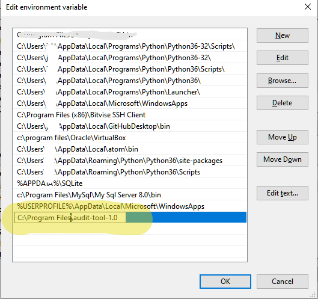
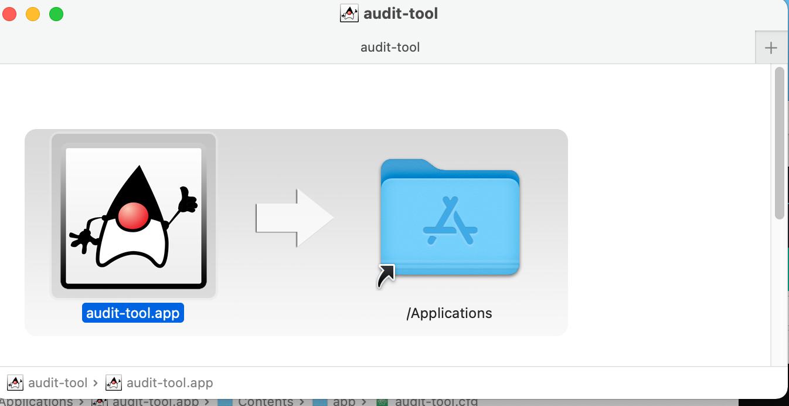

#  Audit Tool Installation

## Version Information
This document refers to the version v1.0-alpha of audit-tool
## New In Version 1.0
Version 1.0 is built and packaged under the most current LTS (Long Term Support) version of Java, 17. It exploits a packaging utility which provides native installation packages on supported MacOS, Debian, and Windows 10 platforms. This provides:

- No requirement for pre-installed Java - Audit-tool provides its own JRE (Java Runtime Engine), at JRE 17.3
- No need to configure a new install.
- Much simpler configuration: shell and Powershell scripts are no longer required.


## Supported Platforms

- Windows 10
- Mac OS X 11.6 (Big Sur) or earlier 11. MacOS 10 version have not been tested.
- Debian 10 (Buster)

**Note**: Release v1.0-alpha does not require supporting packages such as:
- Powershell 3.0 on windows
- gnu coreutils on MacOS
- Java

## Download
Releases are available to download on [asset-manager-code Releases](https://github.com/buda-base/asset-manager/releases)
### v1.0-alpha Download
Please refer to download instructions specific to this release in [v1.0 alpha Github release](https://github.com/buda-base/asset-manager/releases/tag/v1.0-alpha)
For information on validating the download's integrity, please refer to [Appendix I - Download integrity validation](#appendix-i-download-integrity-validation)

### Windows download

## Installation

### Windows installation

#### Run the launcher `audit-tool-1.0.exe`

**Note** if the installer fails to launch within a minute, it may be because there is an existing `audit-tool`
installation. Use Settings | Control Panel | Apps | Uninstall programs to remove it.

**Note** The installer may take a few moments to launch, or to show a selection of folders, if that option is chosen (see below)


If audit tool was installed when you launched, you mAY have an opportunity to choose your action:



You can choose your installation directory:



**Note** if you choose the default installation directory, `audit-tool` will be available to all users of the computer on which it is installed.


#### Setting path
audit-tool still needs to be launched from a console window (such as [Windows Terminal](https://www.microsoft.com/en-US/p/windows-terminal/9n0dx20hk701?activetab=pivot:overviewtab) or  [Fluent Terminal](https://www.microsoft.com/en-us/p/fluent-terminal/9p2krlmfxf9t?activetab=pivot:overviewtab) ).
You may find it helpful to add its location to your PATH.

Settings (You can reach this with the shortcut WindowsKey+Pause) --> find


Edit Environment variables


Select 'Path' and click 'Edit' as shown here:


You'll see each line. Add the line of the installation directory.



You will see a table of your environment variables.

Add the last line (the default installation is shown as an example)



### MacOS installation
Open the downloaded package:



and drag 'audit-tool.app' to '/Applications'

### Debian installation

Values in this table are referred to in the instruction as `{Property}`. (eg, `{Package name}`)

Property|Value
---|---
Application name  |  `audit-tool`
Application version  |  `1.0-alpha`
Package name   |  `audit-v1`
Package-Release|  1
Package File name  |  `audit-v1_1.0-alpha-1_amd64.deb`
Install location  |  `/opt/audit-v1`
Executable  |  `/opt/audit-v1/bin/audit-tool`

Download: TODO: web loc `audit-v1_1.0-alpha-1_amd64.deb` into `some_folder`
Install: `sudo apt install -f some_folder/audit-v1_1.0-alpha-1_amd64.deb`
This creates a package in the Install location above, overwriting existing contents and configurations.


There are several options for general user access:
1. Add `/opt/{Package Name}/bin` to the path of any users who use it.
2. Create a symbolic link in a generally public path: `ln -s /opt/{Package name}/bin/audit-tool`
3. Use the `update-alternatives` scheme to install the version into a list of choices (to allow multiple global installations). While this is more cumbersome, it is more sysadmin friendly than writing directly into /usr/local/bin.

It also automatically creates a link into any directory you choose (in this example, we use `/usr/local/bin`, but you're free to create your own distribution means.)

Suppose you want to install a new version and retain the older one. Since BDRC always changes the package name on every release, you would install them separately.
For this example, we've installed two versions:
audit-tool-v1 and audit-tool-v1.1[^fcf50797]

[^fcf50797]: v1.1 does not exist - for example only

To configure for easy change over, we would:

```
$ sudo update-alternatives --install /usr/local/bin/audit-tool audit-tool /opt/audit-v1/bin/audit-tool 50
$ sudo update-alternatives --install /usr/local/bin/audit-tool audit-tool /opt/audit-v1.1/bin/audit-tool 55
```
You can see the results here, by invoking the config switcher:

```
$  sudo update-alternatives --config audit-tool

There are 2 choices for the alternative audit-tool (providing /usr/local/bin/audit-tool).

  Selection    Path                            Priority   Status
------------------------------------------------------------
* 0            /opt/audit-v1.1/bin/audit-tool   55        auto mode
  1            /opt/audit-v1.1/bin/audit-tool   55        manual mode
  2            /opt/audit-v1/bin/audit-tool     50        manual mode

Press <enter> to keep the current choice[*], or type selection number:
```
You would simply press 1 or 2 here to change the versions you want users to run.


## Configuration
This section applies to all platforms.

`audit-tool` now uses the `app/` subfolder of its installation directory for all its configuration. This file is generated by the install process. Changes you make to it will be overwritten when the application is re-installed.

This configuration replaces the `AT_HOME` and `CONFIG_ATHOME` settings of prior releases. Users with write permission can simply edit the `app/` files:

File|Purpose
---|---
audit-tool.cfg  | Generated list of complete properties to launch the application. Changes to this list are unsupported  
shell.properties  | Parameters for tests (such as names of directories, limits and error overrides)
log4j2.properties  | Logging control

Detailed configuration is described in [AuditToolOperation-1.0-alpha.md](./AuditToolOperation-1.0.md)

## Guidelines for Updating an existing installation
Installation overwrites any prior installations.
It is advisable to save existing configurations in the `app/` folder of the install and **carefully* merge them into a new install.

# Appendices
## Appendix I: Download integrity validation
BDRC uses the best practice SHA512 algorithm to calculate the thumbprint of its release binaries. This section provides instructions on how to generate  a SHA512 digest and compare it with the value given on a release website.

### Windows 10.
#### Method 1: Windows builtin `certutil`
```
certutil -hashfile c:\Users\JDoe\Downloads\someFile SHA512
```
#### Method 2: Power shell
```
Get-FileHash -Path c:\Users\JDoe\Desktop\abc.exe -Algorithm SHA512
```
### Debian
```shell
sha512sum _someFile_
```
### MacOS

```shell
sha512sum _someFile_
```